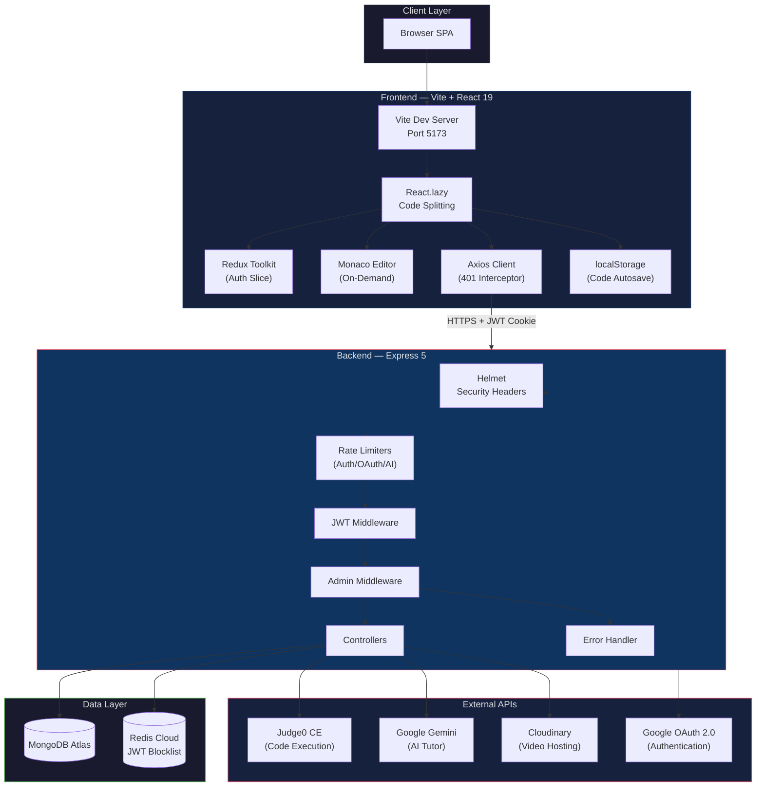
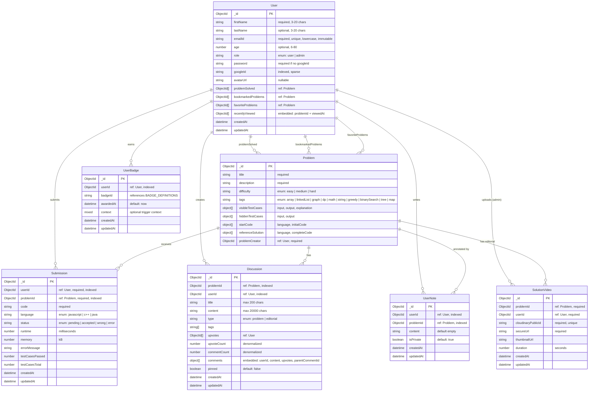
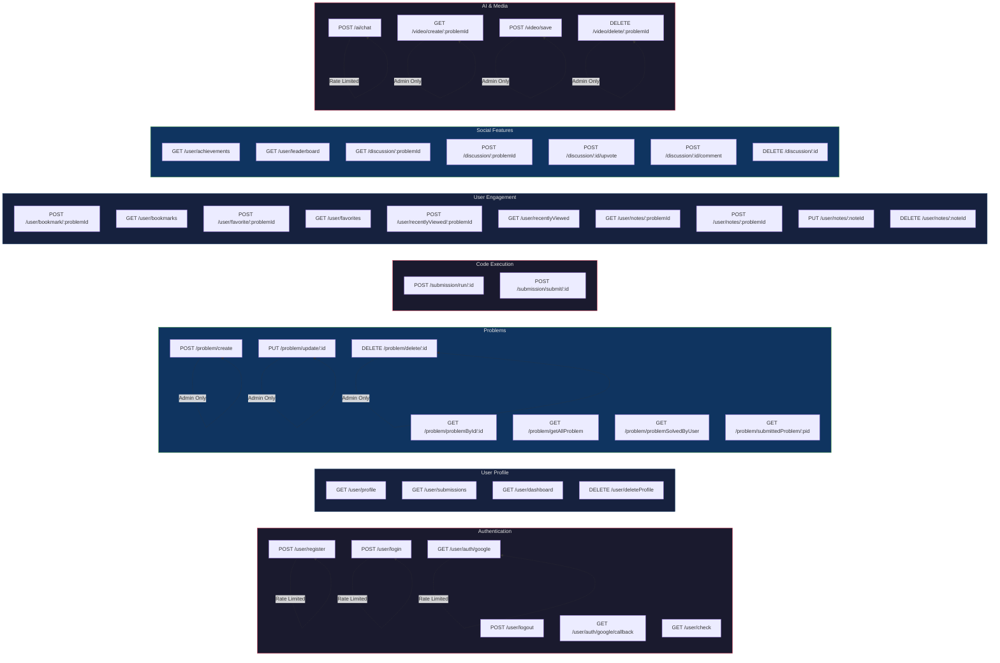
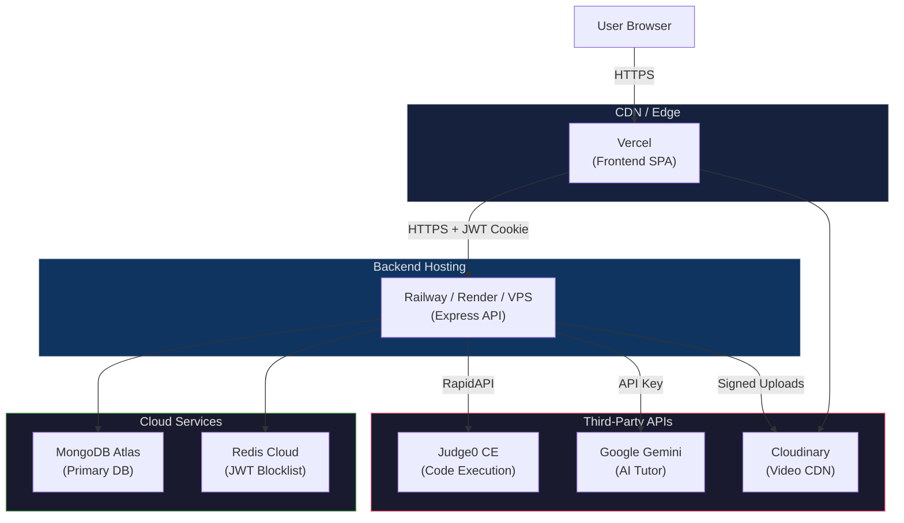

<div align="center">

# XCODE

**A Production-Ready LeetCode-Style Coding Practice Platform**

[](https://react.dev/)
[](https://expressjs.com/)
[](https://www.mongodb.com/)
[](https://redis.io/)
[](https://vitejs.dev/)
[](https://tailwindcss.com/)
[](LICENSE)
[](#production-readiness)

[Features](#features) &bull; [Tech Stack](#tech-stack) &bull; [Architecture](#system-architecture) &bull; [API Docs](#api-endpoints-overview) &bull; [Setup](#installation--setup) &bull; [Contributing](#contributing-guidelines)

</div>

---

## Project Overview

**XCODE** is a full-stack DSA (Data Structures & Algorithms) practice platform inspired by LeetCode. It enables users to browse curated coding problems, write and execute solutions directly in the browser using a Monaco-powered code editor with support for JavaScript, Java, and C++, and receive instant feedback through Judge0-based online judging against both visible and hidden test cases. Beyond core problem-solving, the platform integrates an AI-powered tutoring assistant powered by Google Gemini, video editorials hosted on Cloudinary, per-problem discussion forums, a 15-badge achievement system across four tiers, a global leaderboard, and a GitHub-style 90-day activity heatmap.

The application follows a strict separation of concerns with a React SPA frontend deployed independently from the Express REST API backend. Authentication supports both email/password (bcrypt + JWT) and Google OAuth 2.0 with JWT invalidation via a Redis-backed blocklist. The entire platform was developed across 10 feature batches and 2 stabilization batches, with 38 audit bugs identified and resolved, resulting in a production-readiness score of 8/10.

---

## Problem Statement

Existing coding practice platforms either lack end-to-end feature integration (online execution, AI tutoring, gamification, community discussions in a single cohesive experience) or are not open-source and customizable for educational institutions and self-hosted teams. XCODE bridges this gap by providing a self-hostable, production-grade alternative that combines all of these capabilities into a single deployable stack, with a particular focus on security hardening (Helmet, rate limiting, mass-assignment protection, OAuth open-redirect prevention) and performance (51% initial bundle reduction via code splitting, on-demand Monaco loading, race-condition-safe data fetching).

**Target Users:**

- Competitive programmers preparing for technical interviews
- Computer science students practicing DSA topics
- Educational institutions needing a customizable coding platform
- Engineering teams running internal coding challenges
- Open-source contributors looking for a production-grade full-stack reference project

---

## Features

### Core Problem-Solving

| Feature | Description |
|---|---|
| Online Code Execution | Judge0 CE integration supporting JavaScript, Java, and C++ with sandboxed execution |
| Monaco Editor | VS Code-grade editor with syntax highlighting, autocomplete, and a custom `Xcode-dark` theme |
| Run & Submit | Run code against visible test cases for debugging; submit against hidden test cases for judging |
| Submission History | Per-problem and global submission history with runtime, memory usage, and pass/fail status tracking |
| AI Chat Tutor | Context-aware DSA tutoring via Google Gemini 1.5 Flash with a system-tuned prompt for algorithmic guidance |
| Video Editorials | Cloudinary-hosted solution walkthroughs with signed uploads and admin-managed metadata |

### Authentication & Security

| Feature | Description |
|---|---|
| Email/Password Auth | Registration and login with bcrypt password hashing and input validation |
| Google OAuth 2.0 | Hand-rolled Authorization Code flow (zero passport dependency) with email-linking for existing accounts |
| JWT Blocklist | Redis-backed token invalidation on logout, enabling immediate session termination |
| Role-Based Access Control | User and admin roles validated from the database on every admin-protected request |
| Rate Limiting | Sliding-window rate limiters on auth, OAuth, and AI chat endpoints, configurable via environment variables |

### LeetCode-Style Problem Page

| Feature | Description |
|---|---|
| Resizable Split Panels | Drag-to-resize layout powered by `react-resizable-panels` separating description, editor, and console |
| Fullscreen Editor | Toggle to distraction-free fullscreen mode via `Alt+F` |
| Keyboard Shortcuts | `Ctrl+Enter` submit, `Ctrl+Shift+Enter` run, `Alt+S` save, `Alt+1-5` tab switching |
| Code Autosave | Automatic per-problem, per-language code persistence to `localStorage` |
| Mobile-Responsive | Stacked panel layout on smaller viewports with touch-friendly controls |
| Tab Animations | Smooth Framer Motion transitions between Description, Submissions, Editorial, Notes, and Discussions tabs |

### User Engagement & Gamification

| Feature | Description |
|---|---|
| 15 Achievement Badges | Across 4 categories (solved count, difficulty, streak, special) and 4 tiers (bronze, silver, gold, platinum) |
| Streak Tracking | UTC-day-based solving streaks with grace period through end of current day |
| Global Leaderboard | Paginated rankings by total problems solved, with podium for top 3 and per-user badge counts |
| Activity Graph | GitHub-style 90-day heatmap visualizing daily submission activity |
| Bookmarks & Favorites | Toggle and organize problems for later review |
| Personal Notes | Per-problem, per-user notes with full CRUD operations |
| Recently Viewed | Auto-tracked viewing history capped at 20 entries |
| Related Problems | Tag-based problem recommendations shown in the description tab |
| Threaded Discussions | Per-problem discussions with nested comments, upvotes, and editorial-type separation |

### Admin Panel

| Feature | Description |
|---|---|
| Problem CRUD | Create, update, and delete problems with reference solution validation via Judge0 |
| Video Management | Upload and delete video editorials with Cloudinary signed upload flow |

---

## Tech Stack

### Frontend

| Technology | Version | Purpose |
|---|---|---|
| React | 19.1 | UI component framework with concurrent rendering |
| Vite | 6.3 | Build tooling with HMR and optimized production builds |
| Redux Toolkit | 2.8 | Centralized state management (auth slice) with `injectStore` pattern |
| React Router | 7.6 | Client-side routing with lazy-loaded route components |
| Tailwind CSS | 4.1 | Utility-first CSS framework with CSS-first configuration |
| daisyUI | 5.0 | Component library built on Tailwind for rapid UI development |
| @monaco-editor/react | 4.7 | On-demand VS Code editor embedding with custom theme support |
| react-hook-form + Zod | 7.56 / 3.25 | Performant form handling with schema-validated inputs |
| Framer Motion | 11.18 | Declarative animations for tab transitions and UI micro-interactions |
| react-resizable-panels | 2.1 | Accessible drag-to-resize split panel layouts |
| Lucide React | 0.511 | Consistent, tree-shakeable icon set |
| Axios | 1.9 | HTTP client with centralized 401 interceptor for session management |
| react-markdown + remark-gfm | 10.1 / 4.0 | Rendered Markdown in AI chat responses with GFM table support |

### Backend

| Technology | Version | Purpose |
|---|---|---|
| Express | 5.1 | HTTP server framework with route-level middleware composition |
| Mongoose | 8.14 | MongoDB ODM with schema validation, middleware, and aggregation pipeline support |
| Redis | 5.0 | In-memory data store for JWT token blocklist (O(1) invalidation lookups) |
| jsonwebtoken | 9.0 | JWT signing and verification for stateless authentication |
| bcrypt | 6.0 | Adaptive password hashing (10 salt rounds) |
| @google/genai | 1.3 | Google Gemini 1.5 Flash SDK for AI-powered DSA tutoring |
| Cloudinary | 2.6 | Signed video upload and transformation for solution editorials |
| Helmet | 8.1 | HTTP security headers (HSTS, CSP, X-Frame-Options, X-Content-Type-Options) |
| express-rate-limit | 7.5 | Sliding-window rate limiters for brute-force and cost-abuse prevention |
| validator | 13.15 | Email and password input validation with sanitize chains |
| cookie-parser | 1.4 | Parse and inspect HTTP cookies for JWT extraction |
| dotenv | 16.5 | Environment variable loading from `.env` files |
| cors | 2.8 | Cross-origin resource sharing with credentials support |

### External Services

| Service | Purpose |
|---|---|
| MongoDB Atlas | Managed MongoDB cluster (primary data store) |
| Redis Cloud | Managed Redis instance (JWT blocklist) |
| Judge0 CE (RapidAPI) | Sandboxed code execution engine for 40+ languages |
| Google Gemini API | Large language model for DSA-focused AI tutoring |
| Cloudinary | Media CDN for video editorial hosting with signed uploads |
| Google OAuth 2.0 | Federated authentication via Google identity |

---

## System Architecture



**Request Flow:**

1. The browser loads the SPA as a single `index.html` with JS chunks loaded on-demand via `React.lazy`.
2. On mount, the `checkAuth` thunk calls `GET /user/check` — if the httpOnly JWT cookie is valid and not Redis-blocklisted, Redux hydrates the authenticated user state.
3. Navigation triggers lazy chunk fetching for first-visit routes (ProblemPage, Admin, etc.), keeping the initial bundle at 321 KB.
4. All API calls route through a centralized `axiosClient` instance with a 401 response interceptor that automatically dispatches logout on token expiry.
5. Code submissions flow through `POST /submission/submit/:id`, where the backend batches test cases to Judge0, polls for results with a 60-second timeout, stores the submission document, and triggers badge evaluation on accepted solutions.
6. The JWT cookie uses configurable `httpOnly`, `Secure`, and `SameSite` flags — set to `Secure=true; SameSite=none` in production behind HTTPS, and blocklisted in Redis on logout for immediate invalidation.

---

## Folder Structure

```
XCODE/
├── backend/
│   ├── .env                          # Environment variables (not committed)
│   ├── .env.example                  # Documented env var template
│   ├── package.json
│   └── src/
│       ├── index.js                  # Express entry point, middleware mount, DB/Redis init
│       ├── config/
│       │   ├── db.js                 # MongoDB connection (Mongoose)
│       │   ├── redis.js              # Redis client with auto-reconnect
│       │   └── cookieConfig.js       # Centralized cookie options (env-driven)
│       ├── middleware/
│       │   ├── userMiddleware.js     # JWT verification + Redis blocklist check
│       │   ├── adminMiddleware.js    # Role check from DB (not stale JWT)
│       │   ├── rateLimiters.js       # Auth, OAuth, and AI chat rate limiters
│       │   └── errorHandler.js       # asyncHandler wrapper + centralized error/404 handler
│       ├── models/
│       │   ├── user.js               # User schema (auth, engagement, profile)
│       │   ├── problem.js            # Problem schema (test cases, starter code, reference solution)
│       │   ├── submission.js         # Submission schema (status, runtime, memory)
│       │   ├── solutionVideo.js      # Video editorial metadata
│       │   ├── userNote.js           # Per-user per-problem notes
│       │   ├── userBadge.js          # Awarded badge records (unique user+badge)
│       │   ├── badge.js              # Badge definition schema (reserved for future admin editing)
│       │   └── discussion.js         # Discussion + embedded comments with upvotes
│       ├── controllers/
│       │   ├── userAuthent.js        # Register, login, logout, adminRegister, deleteProfile
│       │   ├── googleAuth.js         # Google OAuth Authorization Code flow
│       │   ├── userProblem.js        # Problem CRUD (admin) + getProblemById, getAllProblem
│       │   ├── userSubmission.js     # Run & submit code via Judge0
│       │   ├── userProfile.js        # Profile stats, submission history, dashboard
│       │   ├── userEngagement.js     # Bookmarks, favorites, notes, recently viewed
│       │   ├── achievements.js       # 15 badge definitions + awarding + leaderboard
│       │   ├── discussion.js         # Discussion CRUD + comments + upvotes
│       │   ├── solveDoubt.js         # AI chat (Gemini 1.5 Flash)
│       │   └── videoSection.js       # Cloudinary signed upload + metadata + delete
│       ├── routes/
│       │   ├── userAuth.js           # /user (auth + profile + dashboard + achievements + leaderboard)
│       │   ├── googleAuth.js         # /user/auth/google + callback
│       │   ├── userEngagement.js     # /user/bookmarks, /favorites, /recentlyViewed, /notes
│       │   ├── problemCreator.js     # /problem (CRUD + list + solved status)
│       │   ├── submit.js             # /submission (run + submit)
│       │   ├── aiChatting.js         # /ai/chat
│       │   ├── videoCreator.js       # /video (Cloudinary upload/delete)
│       │   └── discussion.js         # /discussion (CRUD + comments + upvotes)
│       └── utils/
│           ├── validator.js          # Email/password validation with validator.js
│           └── problemUtility.js     # Judge0 batch submit + poll with 60s timeout
│
├── frontend/
│   ├── .env.example                  # VITE_API_URL template
│   ├── package.json
│   ├── vite.config.js                # Vite configuration
│   ├── vercel.json                   # SPA fallback routing for Vercel
│   ├── eslint.config.js
│   └── src/
│       ├── main.jsx                  # App entry (Provider + BrowserRouter)
│       ├── App.jsx                   # Routes (React.lazy + Suspense + ErrorBoundary)
│       ├── authSlice.js              # Redux auth slice (register, login, checkAuth, logout)
│       ├── store/
│       │   └── store.js              # configureStore + injectStore for axios
│       ├── utils/
│       │   └── axiosClient.js        # Axios instance + 401 interceptor
│       ├── pages/
│       │   ├── Login.jsx             # Email/password + Google OAuth
│       │   ├── Signup.jsx            # Registration + Google OAuth
│       │   ├── Homepage.jsx          # Problem list with difficulty/tag filters
│       │   ├── ProblemPage.jsx       # LeetCode-style resizable problem solver
│       │   ├── Dashboard.jsx         # Daily challenge + stats + recommended problems
│       │   ├── Profile.jsx           # User profile + achievements + activity graph
│       │   ├── Leaderboard.jsx       # Global rankings with podium
│       │   ├── Notes.jsx             # All personal notes across problems
│       │   └── Admin.jsx             # Admin panel navigation menu
│       ├── components/
│       │   ├── AppLayout.jsx         # Authenticated layout with Navbar
│       │   ├── Navbar.jsx            # Navigation bar with avatar and auth state
│       │   ├── AdminPanel.jsx        # Create problem form
│       │   ├── AdminDelete.jsx       # Delete problem list
│       │   ├── AdminVideo.jsx        # Video editorial management
│       │   ├── AdminUpload.jsx       # Cloudinary video uploader with progress
│       │   ├── SubmissionHistory.jsx # Per-problem submission timeline
│       │   ├── ChatAi.jsx            # AI tutoring chat interface
│       │   ├── Editorial.jsx         # Video player for solution editorials
│       │   ├── ActivityGraph.jsx     # GitHub-style 90-day heatmap
│       │   ├── Notes.jsx             # Per-problem notes CRUD
│       │   └── Discussions.jsx       # Discussion list + detail + create
│       ├── authSlice.js
│       └── index.css                 # Tailwind + daisyUI + custom dark theme variables
│
├── README.md
├── DEPLOYMENT.md                     # Detailed deployment guide
├── FINAL_CHANGELOG.md                # Complete development changelog
└── package.json
```

---

## Database Design

### Entity Relationship Diagram



### Design Decisions

- **Embedded comments in Discussion**: Comments are stored as an embedded array rather than a separate collection because typical discussions have fewer than 100 comments. This eliminates join costs and enables atomic reads. If discussions scale beyond ~1,000 comments, a separate `Comment` collection with pagination would be the migration path.
- **Upvote arrays (not counts)**: Both discussions and comments store upvotes as arrays of `userId` ObjectIds, enabling O(1) duplicate-vote detection. A denormalized `upvoteCount` field is kept in sync via a `pre('save')` hook for efficient sorting.
- **Static badge definitions**: Badge metadata is defined in code (15 definitions with evaluator functions) rather than seeded in the database, avoiding migration complexity. Awarded badges are tracked in the `UserBadge` collection with a composite unique index on `{userId, badgeId}`.
- **Cascade delete on User**: A `post('findOneAndDelete')` hook on the User model removes all associated submissions to prevent orphaned references.
- **Additive-only schema evolution**: All schema changes across 10 development batches were additive (new fields with defaults), requiring zero migration scripts.

---

## API Endpoints Overview

### API Flow Diagram



### Endpoint Reference

#### Authentication

| Method | Endpoint | Auth | Rate Limited | Description |
|---|---|---|---|---|
| `POST` | `/user/register` | No | Yes (10/15min) | Register with email, password, firstName, lastName, age |
| `POST` | `/user/login` | No | Yes (10/15min) | Login with email + password; sets httpOnly JWT cookie |
| `POST` | `/user/logout` | Yes | No | Logout; blocklists JWT in Redis, clears cookie |
| `GET` | `/user/auth/google` | No | Yes (10/15min) | Redirect to Google OAuth consent screen |
| `GET` | `/user/auth/google/callback` | No | Yes (10/15min) | Exchange authorization code, set JWT cookie, redirect to frontend |
| `GET` | `/user/check` | Yes | No | Validate JWT cookie, return user payload |
| `POST` | `/user/admin/register` | Admin | No | Create a new admin user |
| `DELETE` | `/user/deleteProfile` | Yes | No | Delete account with cascade (submissions) |

#### Problems

| Method | Endpoint | Auth | Role | Description |
|---|---|---|---|---|
| `POST` | `/problem/create` | Yes | Admin | Create a new problem with test cases, starter code, and reference solution |
| `PUT` | `/problem/update/:id` | Yes | Admin | Update an existing problem |
| `DELETE` | `/problem/delete/:id` | Yes | Admin | Delete a problem |
| `GET` | `/problem/problemById/:id` | Yes | User | Fetch a single problem by ID |
| `GET` | `/problem/getAllProblem` | Yes | User | Fetch all problems with optional difficulty/tag filters |
| `GET` | `/problem/problemSolvedByUser` | Yes | User | Get the current user's solved problem IDs |
| `GET` | `/problem/submittedProblem/:pid` | Yes | User | Get all submissions for a specific problem |

#### Code Execution

| Method | Endpoint | Auth | Description |
|---|---|---|---|
| `POST` | `/submission/run/:id` | Yes | Run code against visible test cases only |
| `POST` | `/submission/submit/:id` | Yes | Submit code against all test cases; updates solved status on acceptance |

#### User Profile & Dashboard

| Method | Endpoint | Auth | Description |
|---|---|---|---|
| `GET` | `/user/profile` | Yes | Profile stats (solved count, difficulty breakdown, acceptance rate, streak) |
| `GET` | `/user/submissions` | Yes | Paginated global submission history |
| `GET` | `/user/dashboard` | Yes | Daily challenge, recommended problems, recent submissions, upcoming contests |

#### User Engagement

| Method | Endpoint | Auth | Description |
|---|---|---|---|
| `POST` | `/user/bookmark/:problemId` | Yes | Toggle bookmark on a problem |
| `GET` | `/user/bookmarks` | Yes | List all bookmarked problems |
| `POST` | `/user/favorite/:problemId` | Yes | Toggle favorite on a problem |
| `GET` | `/user/favorites` | Yes | List all favorited problems |
| `POST` | `/user/recentlyViewed/:problemId` | Yes | Record a problem view (capped at 20) |
| `GET` | `/user/recentlyViewed` | Yes | List recently viewed problems |
| `GET` | `/user/notes/:problemId` | Yes | Get notes for a specific problem |
| `POST` | `/user/notes/:problemId` | Yes | Create a note for a problem |
| `PUT` | `/user/notes/:noteId` | Yes | Update a note |
| `DELETE` | `/user/notes/:noteId` | Yes | Delete a note |

#### Achievements & Leaderboard

| Method | Endpoint | Auth | Description |
|---|---|---|---|
| `GET` | `/user/achievements` | Yes | Earned badges with progress toward unearned badges |
| `GET` | `/user/leaderboard` | Yes | Paginated global rankings by total solved |

#### Discussions

| Method | Endpoint | Auth | Description |
|---|---|---|---|
| `GET` | `/discussion/:problemId` | Yes | List discussions for a problem |
| `GET` | `/discussion/:problemId/:discussionId` | Yes | Get a single discussion with comments |
| `POST` | `/discussion/:problemId` | Yes | Create a new discussion |
| `POST` | `/discussion/:discussionId/upvote` | Yes | Toggle upvote on a discussion |
| `POST` | `/discussion/:discussionId/comment` | Yes | Add a comment (optionally reply to a parent) |
| `POST` | `/discussion/:discussionId/comment/:commentId/upvote` | Yes | Toggle upvote on a comment |
| `DELETE` | `/discussion/:discussionId` | Yes | Delete a discussion (owner or admin only) |
| `DELETE` | `/discussion/:discussionId/comment/:commentId` | Yes | Delete a comment (owner or admin only) |

#### AI Chat & Video Editorials

| Method | Endpoint | Auth | Rate Limited | Role | Description |
|---|---|---|---|---|---|
| `POST` | `/ai/chat` | Yes | Yes (20/min) | User | Send a message to the AI tutor (context: current problem) |
| `GET` | `/video/create/:problemId` | Yes | No | Admin | Generate Cloudinary signed upload URL |
| `POST` | `/video/save` | Yes | No | Admin | Save video metadata after upload |
| `DELETE` | `/video/delete/:problemId` | Yes | No | Admin | Delete a video editorial |

---

## Installation & Setup

### Prerequisites

- **Node.js** 18+ (tested on Node 24)
- **MongoDB** Atlas cluster (free M0 tier) or local instance
- **Redis** Cloud instance (free 30 MB tier) or local instance
- **RapidAPI** account with Judge0 CE subscription
- **Google Cloud** account (for OAuth credentials and Gemini API key)
- **Cloudinary** account (for video editorial uploads)

### Step 1: Clone and Install Dependencies

```bash
git clone https://github.com/your-username/XCODE.git
cd XCODE

# Install backend dependencies
cd backend
npm install

# Install frontend dependencies (separate terminal)
cd ../frontend
npm install
```

### Step 2: Configure Environment Variables

```bash
# Backend environment
cp backend/.env.example backend/.env

# Frontend environment
cp frontend/.env.example frontend/.env
```

Edit `backend/.env` with your actual credentials. See the [Environment Variables](#environment-variables) section below for the complete reference.

### Step 3: Generate a JWT Secret

```bash
openssl rand -hex 32
# Paste the output as JWT_KEY in backend/.env
```

### Step 4: Set Up External Services

Each external service requires a one-time setup. Detailed step-by-step guides for MongoDB Atlas, Redis Cloud, Judge0, Google Gemini, Google OAuth, and Cloudinary are available in [DEPLOYMENT.md](./DEPLOYMENT.md).

---

## Environment Variables

### Backend Variables

| Variable | Required | Default | Description |
|---|---|---|---|
| `NODE_ENV` | Yes | `development` | Runtime mode. Set to `production` to suppress error details in responses |
| `PORT` | Yes | `3000` | Express server listen port |
| `CLIENT_URL` | Yes | `http://localhost:5173` | Frontend URL (CORS origin, OAuth redirect target, CSP) |
| `DB_CONNECT_STRING` | Yes | — | MongoDB connection string (`mongodb+srv://...`) |
| `REDIS_HOST` | Yes | — | Redis instance hostname |
| `REDIS_PORT` | Yes | — | Redis instance port |
| `REDIS_PASS` | Yes | — | Redis instance password |
| `JWT_KEY` | Yes | — | HMAC secret for JWT signing (generate with `openssl rand -hex 32`) |
| `CLOUDINARY_CLOUD_NAME` | Yes | — | Cloudinary cloud name |
| `CLOUDINARY_API_KEY` | Yes | — | Cloudinary API key |
| `CLOUDINARY_API_SECRET` | Yes | — | Cloudinary API secret |
| `JUDGE0_KEY` | Yes | — | RapidAPI key for Judge0 CE |
| `GEMINI_KEY` | Yes | — | Google Gemini API key |
| `GOOGLE_CLIENT_ID` | Yes* | — | Google OAuth 2.0 Client ID |
| `GOOGLE_CLIENT_SECRET` | Yes* | — | Google OAuth 2.0 Client Secret |
| `GOOGLE_REDIRECT_URI` | Yes* | — | OAuth callback URL (required to prevent open-redirect attacks) |
| `COOKIE_SECURE` | Yes | `false` | `true` in production (requires HTTPS) |
| `COOKIE_SAMESITE` | Yes | `lax` | `none` in production (requires `COOKIE_SECURE=true`) |
| `COOKIE_MAX_AGE` | No | `3600000` | Cookie lifetime in milliseconds |
| `RATE_LIMIT_AUTH_MAX` | No | `10` | Max auth attempts per window |
| `RATE_LIMIT_AUTH_WINDOW_MS` | No | `900000` | Auth rate-limit window (15 min) |
| `RATE_LIMIT_OAUTH_MAX` | No | `10` | Max OAuth attempts per window |
| `RATE_LIMIT_OAUTH_WINDOW_MS` | No | `900000` | OAuth rate-limit window (15 min) |
| `RATE_LIMIT_AI_MAX` | No | `20` | Max AI chat requests per window |
| `RATE_LIMIT_AI_WINDOW_MS` | No | `60000` | AI chat rate-limit window (1 min) |

\* Google OAuth variables are required only if Google sign-in is needed. Email/password authentication works without them.

### Frontend Variables

| Variable | Required | Default | Description |
|---|---|---|---|
| `VITE_API_URL` | Yes | `http://localhost:3000` | Backend API base URL (inlined at build time by Vite) |

---

## Running Locally

```bash
# Terminal 1 — Start the backend
cd backend
npm start
# Server runs on http://localhost:3000

# Terminal 2 — Start the frontend dev server
cd frontend
npm run dev
# Vite dev server runs on http://localhost:5173
```

Open `http://localhost:5173` in your browser. Register a new account or log in to access the dashboard.

> **Note:** Ensure MongoDB and Redis are accessible before starting the backend. If Redis is unavailable, the server still starts, but logout will not immediately invalidate tokens (they expire naturally after 1 hour).

---

## Deployment Guide

### Deployment Architecture



### Frontend Deployment (Vercel — Recommended)

1. Push the repository to GitHub
2. Import to [Vercel](https://vercel.com/new) with root directory set to `frontend`
3. Configure the build: Framework = **Vite**, Build Command = `npm run build`, Output Directory = `dist`
4. Set the environment variable `VITE_API_URL` to your production backend URL
5. Vercel handles SPA routing automatically via the included `vercel.json`

### Backend Deployment (Railway — Recommended)

1. Import the repository to [Railway](https://railway.app/new) with root directory set to `backend`
2. Set the start command to `npm start`
3. Configure all backend environment variables (see the table above)
4. Railway auto-detects the port from the `PORT` environment variable

### Post-Deploy Verification

```bash
# Verify security headers are present
curl -I https://api.yourdomain.com/user/check

# Verify rate limiting (11th request should return 429)
for i in $(seq 1 11); do curl -s -o /dev/null -w "%{http_code}\n" -X POST https://api.yourdomain.com/user/login; done

# Verify cookie configuration
curl -v https://api.yourdomain.com/user/login -d '{"emailId":"test@example.com","password":"test"}' 2>&1 | grep Set-Cookie
```

For the complete deployment guide including Netlify, S3 + CloudFront, and VPS options with Nginx + PM2 setup, see [DEPLOYMENT.md](./DEPLOYMENT.md).

---

## Security Features

| Security Measure | Implementation | Protection Against |
|---|---|---|
| **Helmet** | CSP, HSTS, X-Frame-Options, X-Content-Type-Options headers | XSS, clickjacking, MIME sniffing, protocol downgrade |
| **Rate Limiting** | Sliding-window limiters on auth (10/15min), OAuth (10/15min), AI (20/min) | Brute-force attacks, OAuth token farming, AI cost abuse |
| **JWT Blocklist** | Redis-backed O(1) token invalidation on logout | Session hijacking after logout |
| **Mass-Assignment Protection** | Field whitelisting in register, adminRegister, and createProblem | Privilege escalation via injected fields (e.g., `role: "admin"`) |
| **Reference Solution Gating** | Hidden until user has an accepted submission for the problem | Unauthorized access to model solutions |
| **Admin Role from DB** | Admin middleware queries the database on every request, not the JWT | Stale JWT privilege escalation |
| **OAuth Open-Redirect Prevention** | `GOOGLE_REDIRECT_URI` must be set via env var; controller rejects if empty | Open-redirect attacks via spoofed `X-Forwarded-Host` |
| **Trust Proxy** | `app.set('trust proxy', 1)` configured for reverse proxy deployments | Rate-limit bypass when behind shared proxies |
| **Centralized Error Handler** | Production mode returns generic "Internal server error" (no stack traces) | Information leakage via error messages |
| **Cookie Security** | httpOnly, configurable Secure and SameSite flags | XSS token theft, CSRF |
| **Cascade Delete** | User deletion removes all associated submissions | Orphaned data referencing deleted users |
| **ObjectId Validation** | All discussion and note endpoints validate ObjectId format | Invalid MongoDB queries from malformed IDs |
| **Upvote Array Stripping** | Discussion and comment upvote arrays are excluded from API responses | User enumeration via upvote membership |

---

## Performance Optimizations

| Optimization | Impact | Technical Detail |
|---|---|---|
| **Route-Level Code Splitting** | 51% bundle reduction (649 KB to 321 KB) | `React.lazy` + `Suspense` on all 12 route components; chunks loaded on first navigation |
| **On-Demand Monaco Loading** | Editor code excluded from initial bundle | `@monaco-editor/react` loaded only when the ProblemPage route is visited |
| **Memoization** | Reduced re-renders on hot paths | `useMemo` on Homepage filter computations and ProblemPage tab content; `useCallback` on event handlers |
| **Axios 401 Interceptor** | Instant session termination | Automatically dispatches logout on any 401 response, preventing stuck authenticated states |
| **Race-Condition-Safe Fetching** | No state corruption from rapid navigation | Cancellation flags in `useEffect` prevent stale async responses from overwriting current state |
| **Judge0 Polling Timeout** | No infinite backend hangs | 60-second hard cap on Judge0 result polling with configurable batch interval |
| **Redis O(1) Blocklist** | Sub-millisecond token invalidation | SET/GET operations on individual JWT keys rather than scanning a list |
| **Mongoose Indexes** | Optimized hot-path queries | Compound index on `Submission(userId, problemId)`, composite index on `UserNote(userId, problemId)`, indexes on `Discussion.problemId` |
| **Denormalized Counts** | Efficient sorting without aggregation | `Discussion.upvoteCount` and `Discussion.commentCount` synced via `pre('save')` hook |

---

## Screenshots

> Screenshots are not included in the repository to keep the Git history lightweight. The platform includes the following views:
>
> - **Login/Signup** — Clean auth pages with email/password and Google OAuth buttons
> - **Dashboard** — Daily challenge, recommended problems, progress stats, and 30-day activity graph
> - **Homepage** — Filterable problem list with difficulty (Easy/Medium/Hard) and tag (Array, DP, Graph, etc.) filters
> - **Problem Page** — LeetCode-style resizable split panels with Monaco editor, console output, and tabbed sidebar
> - **Profile** — Full stats, 90-day activity heatmap, achievement badges with progress bars, bookmarks, and favorites
> - **Leaderboard** — Global rankings with podium display for top 3 and paginated table
> - **Discussions** — Per-problem threaded discussions with upvotes and nested comments
> - **AI Chat** — Context-aware tutoring interface with markdown-rendered responses and quick-suggestion buttons
> - **Admin Panel** — Problem CRUD, video editorial management, and Cloudinary upload progress

Run the application locally to explore all features.

---

## Future Enhancements

- **Contest System** — Real timed competitive programming contests with live rankings (currently a placeholder)
- **Custom Test Cases** — Allow users to add their own test cases for debugging beyond the visible set
- **Peer Code Review** — Enable users to review and comment on each other's accepted submissions
- **Follow System** — Follow other users and view their recent activity and solved problems
- **Multi-Tag Filtering** — Filter problems by multiple tags simultaneously (currently single-tag only)
- **Full-Text Search** — Search across problem titles, descriptions, and discussion content
- **In-App Notifications** — Real-time notifications for discussion replies, badge awards, and streak milestones
- **Dark/Light Theme Toggle** — Currently dark-only; add a light theme variant
- **Progressive Web App** — Offline support and push notifications via a PWA manifest
- **Automated Testing** — Unit and integration tests for both frontend (Vitest + React Testing Library) and backend (Jest + Supertest)
- **TypeScript Migration** — Migrate the entire codebase to TypeScript for compile-time type safety
- **CI/CD Pipeline** — Automated builds, linting, and deployments via GitHub Actions
- **Docker Compose** — One-command local development environment with all external services containerized
- **WebSocket Integration** — Real-time features (live contest rankings, typing indicators in discussions, collaborative editing)

---

## Contributing Guidelines

Contributions are welcome. Follow these steps to contribute:

1. **Fork** the repository and create a feature branch from `main`
2. **Install dependencies** in both `backend/` and `frontend/` directories
3. **Follow existing patterns** — controllers use the `asyncHandler` wrapper, routes use `try/catch` via the centralized error handler, and models use Mongoose schemas with `timestamps: true`
4. **Write clean, documented code** — add JSDoc comments for new functions and explain non-obvious decisions in inline comments
5. **Test manually** — verify new features work with both email/password and Google OAuth auth flows
6. **Do not commit secrets** — never commit `.env` files, API keys, or connection strings
7. **Submit a pull request** with a clear description of the change, affected files, and testing steps

### Code Style

- **Backend**: CommonJS modules, 2-space indentation, Express 5 async middleware patterns
- **Frontend**: ES modules, functional components with hooks, Tailwind utility classes for styling

---

## License

This project is licensed under the [ISC License](LICENSE).

---

## Author Information

Built as a production-readiness exercise across 10 development batches and 2 stabilization batches, with 38 audit bugs identified and resolved. The platform demonstrates full-stack engineering practices including security hardening, performance optimization, schema design, and external service integration.

For questions, issues, or collaboration, open a [GitHub Issue](https://github.com/your-username/x_code/issues).